# 🔐 Configuração de GitHub Actions para Deploy Azure

## 📋 Pré-requisitos

Este projeto utiliza **GitHub Actions** com **OIDC (OpenID Connect)** para deploy automático no Azure, seguindo as **melhores práticas da Microsoft**.

### ✅ Vantagens desta abordagem:
- ✅ **Sem secrets de senha** - Usa autenticação OIDC
- ✅ **Separação de responsabilidades** - Infraestrutura ≠ Aplicação
- ✅ **Rastreabilidade** - Cada workflow tem propósito claro
- ✅ **Alinhado com Well-Architected Framework**

---

## 🚀 Passo 1: Configurar OIDC no Azure

### 1.1 Criar User-Assigned Managed Identity

```bash
# Defina as variáveis
RESOURCE_GROUP="rg-github-actions"
LOCATION="brazilsouth"
IDENTITY_NAME="id-github-actions-deploy"
SUBSCRIPTION_ID=$(az account show --query id -o tsv)

# Crie o resource group
az group create --name $RESOURCE_GROUP --location $LOCATION

# Crie a Managed Identity
az identity create \
  --name $IDENTITY_NAME \
  --resource-group $RESOURCE_GROUP \
  --location $LOCATION

# Obtenha o Client ID
CLIENT_ID=$(az identity show \
  --name $IDENTITY_NAME \
  --resource-group $RESOURCE_GROUP \
  --query clientId -o tsv)

echo "CLIENT_ID: $CLIENT_ID"
```

### 1.2 Atribuir Permissões

```bash
# Contributor - para criar recursos
az role assignment create \
  --assignee $CLIENT_ID \
  --role "Contributor" \
  --scope /subscriptions/$SUBSCRIPTION_ID

# User Access Administrator - para criar role assignments
az role assignment create \
  --assignee $CLIENT_ID \
  --role "User Access Administrator" \
  --scope /subscriptions/$SUBSCRIPTION_ID
```

### 1.3 Configurar Federated Identity Credential

```bash
# Substitua pelos seus valores
GITHUB_ORG="AndressaSiqueira"
GITHUB_REPO="Webapp"

# Crie o Federated Credential
az identity federated-credential create \
  --name "github-actions-federated" \
  --identity-name $IDENTITY_NAME \
  --resource-group $RESOURCE_GROUP \
  --issuer "https://token.actions.githubusercontent.com" \
  --subject "repo:${GITHUB_ORG}/${GITHUB_REPO}:ref:refs/heads/master" \
  --audiences "api://AzureADTokenExchange"
```

---

## 🔑 Passo 2: Configurar Secrets no GitHub

Vá para: **Settings** → **Secrets and variables** → **Actions** → **New repository secret**

Configure os seguintes secrets:

| Secret Name | Valor | Como obter |
|------------|-------|-----------|
| `AZURE_CLIENT_ID` | Client ID da Managed Identity | `az identity show --name id-github-actions-deploy --resource-group rg-github-actions --query clientId -o tsv` |
| `AZURE_TENANT_ID` | Tenant ID do Azure | `az account show --query tenantId -o tsv` |
| `AZURE_SUBSCRIPTION_ID` | Subscription ID | `az account show --query id -o tsv` |

---

## 📦 Passo 3: Executar os Workflows

### 3.1 Deploy da Infraestrutura

1. Vá para **Actions** → **1️⃣ Deploy Infrastructure**
2. Clique em **Run workflow**
3. Preencha os parâmetros:
   - **resourceGroupName**: `rg-ai-container-demo`
   - **containerAppName**: `ai-container-app`
   - **acrName**: Nome do seu ACR
   - **azureOpenAIEndpoint**: `https://seu-modelo.openai.azure.com/`
   - **azureOpenAIDeployment**: `gpt-4o`
   - **openAiResourceId**: `/subscriptions/{sub}/resourceGroups/{rg}/providers/Microsoft.CognitiveServices/accounts/{nome}`

4. Clique em **Run workflow**

**O que acontece:**
- ✅ Cria Container App com `minReplicas: 0` (inativo)
- ✅ Configura role assignments (AcrPull + OpenAI User)
- ✅ Configura Log Analytics + Environment

### 3.2 Ativar o Container App (após 2-3 minutos)

⏰ **IMPORTANTE: Aguarde 2-3 minutos** para propagação de permissões!

1. Vá para **Actions** → **2️⃣ Activate Container App**
2. Clique em **Run workflow**
3. Preencha os parâmetros:
   - **resourceGroupName**: `rg-ai-container-demo`
   - **containerAppName**: `ai-container-app`
   - **waitTimeMinutes**: `2` (ou `3` para ser mais conservador)

4. Clique em **Run workflow**

**O que acontece:**
- ⏳ Aguarda 2 minutos automaticamente (role propagation)
- ✅ Ativa o Container App (`minReplicas: 1`)
- 🌐 Mostra a URL do Container App

---

## 🎯 Fluxo Completo

```mermaid
graph TD
    A[1️⃣ Deploy Infrastructure] --> B[Container App criado minReplicas=0]
    B --> C[Role Assignments criados]
    C --> D[⏰ Aguardar 2-3 minutos]
    D --> E[2️⃣ Activate Container App]
    E --> F[Sleep automático 2 minutos]
    F --> G[az containerapp update --min-replicas 1]
    G --> H[✅ Container App ativo e funcional]
```



---

## 🔍 Troubleshooting

### Erro: "Federated credential not found"
- Verifique se o `subject` do federated credential está correto
- Deve ser: `repo:AndressaSiqueira/Webapp:ref:refs/heads/master`

### Erro: "Insufficient permissions"
- Verifique se a Managed Identity tem roles `Contributor` + `User Access Administrator`

### Erro: "401 Unauthorized" ao chamar OpenAI
- Aguarde mais tempo antes do workflow 2
- Tente executar novamente com `waitTimeMinutes: 3`

### Como verificar propagação de roles manualmente:
```bash
az containerapp show \
  --name ai-container-app \
  --resource-group rg-ai-container-demo \
  --query 'identity.principalId' -o tsv

# Depois verifique role assignments
az role assignment list --assignee <principalId> -o table
```

---

## 📚 Referências

- [Deploy Bicep with GitHub Actions (Microsoft)](https://learn.microsoft.com/en-us/azure/azure-resource-manager/bicep/deploy-github-actions)
- [OIDC Authentication (GitHub)](https://docs.github.com/en/actions/security-for-github-actions/security-hardening-your-deployments/configuring-openid-connect-in-azure)
- [Azure Container Apps Best Practices](https://learn.microsoft.com/en-us/azure/well-architected/service-guides/azure-container-apps)
- [Azure RBAC Role Propagation](https://learn.microsoft.com/en-us/azure/role-based-access-control/troubleshooting)

---

## ✅ Checklist de Setup

- [ ] Managed Identity criada
- [ ] Roles atribuídas (Contributor + User Access Administrator)
- [ ] Federated Credential configurado
- [ ] Secrets configurados no GitHub
- [ ] Workflow 1 executado com sucesso
- [ ] Aguardado 2-3 minutos
- [ ] Workflow 2 executado com sucesso
- [ ] Container App ativo e respondendo

---

**🎉 Pronto! Deploy profissional seguindo melhores práticas da Microsoft!**
