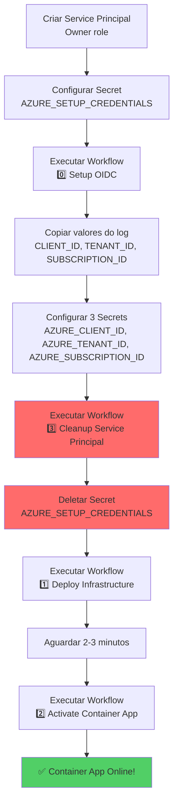

# Setup OIDC com Service Principal - Guia Completo

## 📋 Pré-requisitos

Para executar o workflow `0️⃣ Setup OIDC`, você precisa criar um **Service Principal temporário** com permissões elevadas. Este Service Principal será usado **apenas para criar a Managed Identity** que será usada nos deploys.

## 🔐 Passo 1: Criar Service Principal (One-Time)

Execute este comando **uma única vez** no Azure CLI:

```bash
az ad sp create-for-rbac \
  --name "sp-github-oidc-setup" \
  --role "Owner" \
  --scopes "/subscriptions/<SUA-SUBSCRIPTION-ID>" \
  --sdk-auth
```

**⚠️ Importante:**
- Substitua `<SUA-SUBSCRIPTION-ID>` pelo ID da sua subscription
- O role `Owner` é necessário para criar Managed Identity e atribuir roles
- Guarde o output JSON em local seguro (você usará apenas uma vez)

### Como obter sua Subscription ID:

```bash
az account show --query id -o tsv
```

### Exemplo de output:

```json
{
  "clientId": "xxxxxxxx-xxxx-xxxx-xxxx-xxxxxxxxxxxx",
  "clientSecret": "xxxxxxxxxxxxxxxxxxxxxxxxxxxxxxxxxxxx",
  "subscriptionId": "xxxxxxxx-xxxx-xxxx-xxxx-xxxxxxxxxxxx",
  "tenantId": "xxxxxxxx-xxxx-xxxx-xxxx-xxxxxxxxxxxx",
  "activeDirectoryEndpointUrl": "https://login.microsoftonline.com",
  "resourceManagerEndpointUrl": "https://management.azure.com/",
  "activeDirectoryGraphResourceId": "https://graph.windows.net/",
  "sqlManagementEndpointUrl": "https://management.core.windows.net:8443/",
  "galleryEndpointUrl": "https://gallery.azure.com/",
  "managementEndpointUrl": "https://management.core.windows.net/"
}
```

## 🔑 Passo 2: Configurar Secret no GitHub

1. Vá para: `https://github.com/<SEU-ORG>/<SEU-REPO>/settings/secrets/actions`

2. Clique em **New repository secret**

3. Configure o secret:
   - **Name:** `AZURE_SETUP_CREDENTIALS`
   - **Value:** Cole o JSON completo do output do comando anterior

4. Clique em **Add secret**

## ▶️ Passo 3: Executar Workflow de Setup

1. Vá para: `https://github.com/<SEU-ORG>/<SEU-REPO>/actions`

2. Clique no workflow: **0️⃣ Setup OIDC (One-Time Setup)**

3. Clique em **Run workflow**

4. Preencha os campos (ou use os padrões):
   - **GitHub Organization/Owner:** `AndressaSiqueira`
   - **GitHub Repository:** `Webapp`
   - **Branch name:** `master`
   - **Resource Group:** `rg-github-actions-oidc`
   - **Azure Location:** `brazilsouth`
   - **Managed Identity Name:** `id-github-actions-deploy`

5. Clique em **Run workflow**

6. Aguarde a execução (1-2 minutos)

## 📋 Passo 4: Configurar Secrets do OIDC

Após o workflow terminar com sucesso:

1. Copie os 3 valores exibidos no log do workflow (última etapa)

2. Vá para: `https://github.com/<SEU-ORG>/<SEU-REPO>/settings/secrets/actions`

3. Configure os 3 secrets:

   **Secret 1:**
   - Name: `AZURE_CLIENT_ID`
   - Value: `<valor exibido no log>`

   **Secret 2:**
   - Name: `AZURE_TENANT_ID`
   - Value: `<valor exibido no log>`

   **Secret 3:**
   - Name: `AZURE_SUBSCRIPTION_ID`
   - Value: `<valor exibido no log>`

## 🧹 Passo 5: Limpeza Automatizada (Recomendado)

Após configurar os 3 secrets do OIDC, **delete o Service Principal usando o workflow automatizado**:

### **Opção A: Workflow Automatizado (RECOMENDADO)** ✅

1. Vá para: `https://github.com/<SEU-ORG>/<SEU-REPO>/actions`

2. Clique no workflow: **3️⃣ Cleanup Service Principal**

3. Clique em **Run workflow**

4. Preencha:
   - **Service Principal Name:** `sp-github-oidc-setup`
   - **Confirm Deletion:** `DELETE` (digite exatamente)

5. Clique em **Run workflow**

6. O workflow irá:
   - ✅ Validar que você confirmou a deleção
   - ✅ Buscar o Service Principal
   - ✅ Deletar o Service Principal
   - ✅ Exibir próximos passos

7. **Delete o secret `AZURE_SETUP_CREDENTIALS`** do GitHub:
   - Vá para: `https://github.com/<SEU-ORG>/<SEU-REPO>/settings/secrets/actions`
   - Encontre `AZURE_SETUP_CREDENTIALS`
   - Clique em **Remove**

### **Opção B: Limpeza Manual** (Alternativa)

Se preferir fazer manualmente via Azure CLI:

```bash
# Listar Service Principals para encontrar o ID
az ad sp list --display-name "sp-github-oidc-setup" --query "[].{Name:displayName, AppId:appId, ObjectId:id}" -o table

# Deletar o Service Principal
az ad sp delete --id <APP-ID>
```

**Também delete o secret `AZURE_SETUP_CREDENTIALS`** do GitHub:
1. Vá para: `https://github.com/<SEU-ORG>/<SEU-REPO>/settings/secrets/actions`
2. Encontre `AZURE_SETUP_CREDENTIALS`
3. Clique em **Remove**

## ✅ Passo 6: Executar Workflows de Deploy

Agora você pode usar os workflows principais:

1. Execute: **1️⃣ Deploy Infrastructure**
2. Aguarde 2-3 minutos
3. Execute: **2️⃣ Activate Container App**

## 🔄 Fluxo Completo



## 🆚 Comparação: Workflow vs Script Local

| Aspecto | Workflow (Service Principal) | Script Local |
|---------|------------------------------|--------------|
| **Complexidade inicial** | Alta (criar Service Principal) | Baixa (apenas `az login`) |
| **Execução** | Automática no GitHub | Manual no computador |
| **Auditoria** | Logs no GitHub Actions | Logs locais |
| **Segurança** | Service Principal temporário | Credenciais pessoais |
| **Recomendado para** | Equipes, automação | Uso individual |

## ❓ Troubleshooting

### Erro: "insufficient privileges to complete the operation"

**Causa:** Service Principal não tem permissões de Owner

**Solução:** Recrie o Service Principal com role `Owner`:
```bash
az ad sp create-for-rbac --name "sp-github-oidc-setup" --role "Owner" --scopes "/subscriptions/<SUBSCRIPTION-ID>" --sdk-auth
```

### Erro: "The client does not have authorization to perform action"

**Causa:** Secret `AZURE_SETUP_CREDENTIALS` não foi configurado

**Solução:** Configure o secret conforme Passo 2

### Workflow falha em "Atribuir Role"

**Causa:** Managed Identity acabou de ser criada, precisa aguardar propagação

**Solução:** O workflow já tem `sleep 30` após criar a identity. Se persistir, re-execute o workflow.

## 📚 Referências

- [Azure CLI - Create Service Principal](https://learn.microsoft.com/cli/azure/ad/sp?view=azure-cli-latest#az-ad-sp-create-for-rbac)
- [GitHub Actions - Azure Login](https://github.com/Azure/login)
- [Azure - Managed Identities](https://learn.microsoft.com/azure/active-directory/managed-identities-azure-resources/overview)
- [Azure - Federated Identity Credentials](https://learn.microsoft.com/azure/active-directory/develop/workload-identity-federation)
